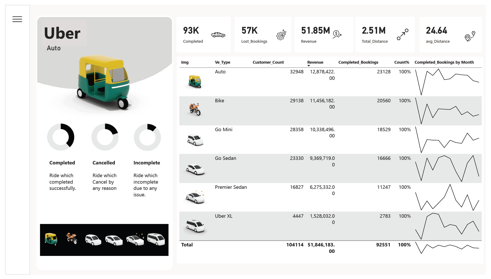

# Uber Rides Analysis - Power BI Dashboard

## 📊 Project Overview

This Power BI project provides a comprehensive analysis of Uber ride data, focusing on key performance metrics, revenue analysis, customer behavior, and operational insights. The dashboard offers interactive visualizations to explore ride completion rates, revenue by vehicle type, customer patterns, and geographical trends.

## 🎯 Key Metrics Tracked

- **Completed Rides**: 93K
- **Lost Bookings**: 57K
- **Total Revenue**: 51.85M
- **Total Distance**: 2.51M
- **Average Distance per Ride**: 24.64

## 📈 Dashboard Sections

### 1. **Ride Performance**
   - Completed Rides (successful trips)
   - Cancelled Rides (trips canceled for any reason)
   - Incomplete Rides (trips with issues)

### 2. **Revenue Analysis**
   - Monthly and quarterly revenue trends
   - Revenue by vehicle type (Auto, Bike, Go Mini, Go Sedan, Premier Sedan, Uber XL)
   - Payment method breakdown (UPI, Cash, Uber Wallet, Credit Card, Debit Card)

### 3. **Customer Insights**
   - Customer segmentation:
     - First Time Riders
     - Return Riders (two rides)
     - Regular Riders (three or more rides)
   - Top customers by revenue
   - Monthly customer trends

### 4. **Operational Metrics**
   - Total distance traveled by vehicle type
   - Popular pickup locations
   - Ride distribution across time slots (24-hour analysis)
   - Customer and driver ratings

## 🚗 Vehicle Types Analyzed

- Auto
- Bike
- Go Mini
- Go Sedan
- Premier Sedan
- Uber XL

## 💰 Payment Methods

- UPI
- Cash
- Uber Wallet
- Credit Card
- Debit Card

## 📅 Time Analysis

- **Monthly trends** for revenue, customers, and rides
- **Quarterly performance** overview
- **Time slot analysis** (12 AM - 12 AM in 3-hour intervals)
- **Day-wise distribution** across the week

## 🎨 Visualization Features

- Interactive filters for Month/Quarter views
- Comparative analysis across different vehicle types
- Geographic insights on pickup locations
- Customer behavior patterns
- Revenue distribution across multiple dimensions

## 📁 Data Sources

The dashboard integrates multiple data points including:
- Ride completion status
- Customer demographics
- Payment transactions
- Geographic coordinates
- Time and date stamps
- Vehicle type information

## 🛠️ Technical Implementation

- Built using **Power BI Desktop**
- Multiple interconnected data tables
- Advanced DAX calculations for metrics
- Interactive slicers and filters
- Responsive visual design

## 📊 Business Value

This dashboard helps stakeholders:
- Monitor ride performance and revenue trends
- Understand customer preferences and behavior
- Optimize vehicle fleet allocation
- Identify peak hours and popular locations
- Analyze payment method preferences
- Make data-driven decisions for business growth

---

*Note: This PDF represents a snapshot of the interactive Power BI dashboard with comprehensive Uber ride analytics.*
